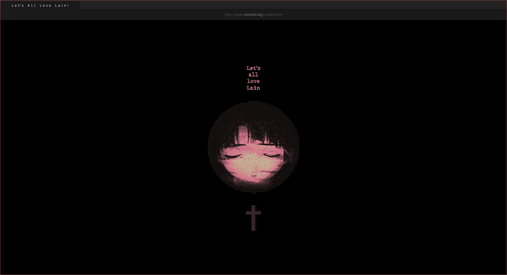

# Firefox CSS

Updated for Firefox 89. Drop into `$HOME/.mozilla/firefox/[profile]/chrome`.

Pywal colour scheme from [dotfiles](https://github.com/blankaex/dotfiles). See also: [firefox-csshacks](https://github.com/MrOtherGuy/firefox-csshacks).

## Preview

