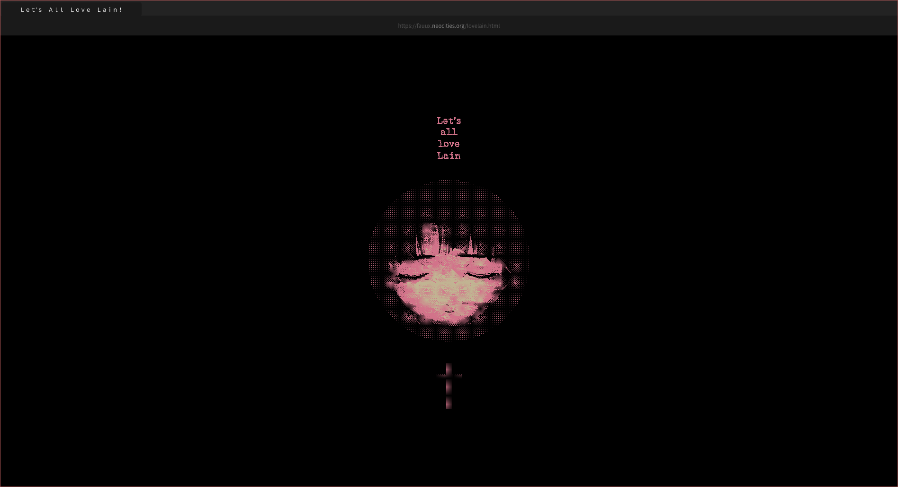
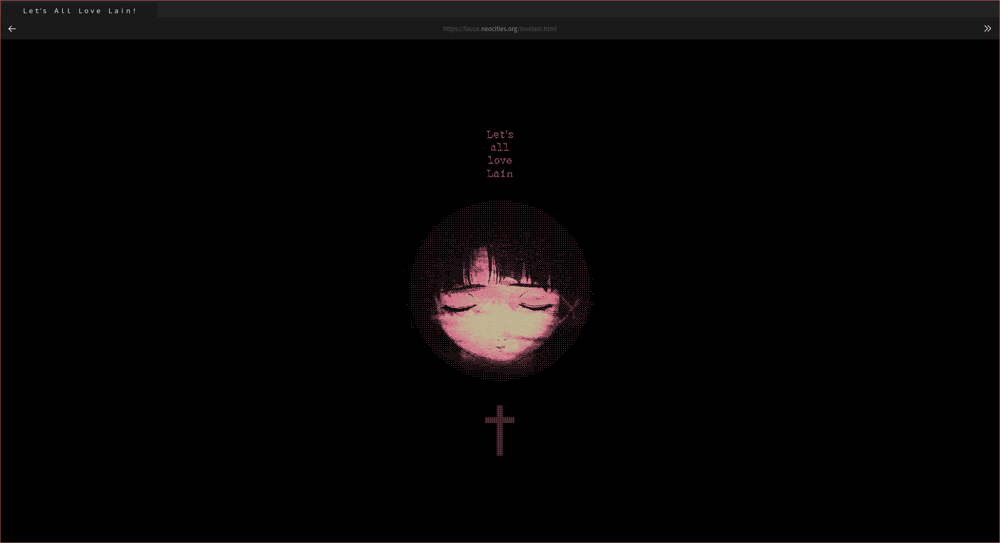
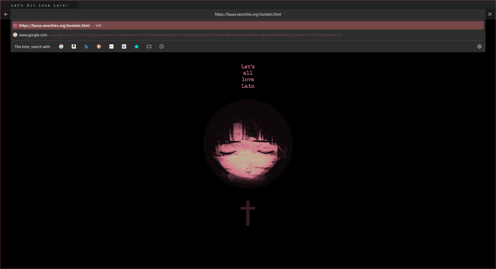

# Firefox CSS

Updated for Firefox 149.0. Drop into `$HOME/.mozilla/firefox/[profile]/chrome` and [update path](https://github.com/blankaex/userChrome/blob/master/userChrome.css#L2) to import colours.

Pywal colour scheme from [dotfiles](https://github.com/blankaex/dotfiles). See also: [firefox-csshacks](https://github.com/MrOtherGuy/firefox-csshacks).

## Preview

Default

Hover urlbar

Focus urlbar

